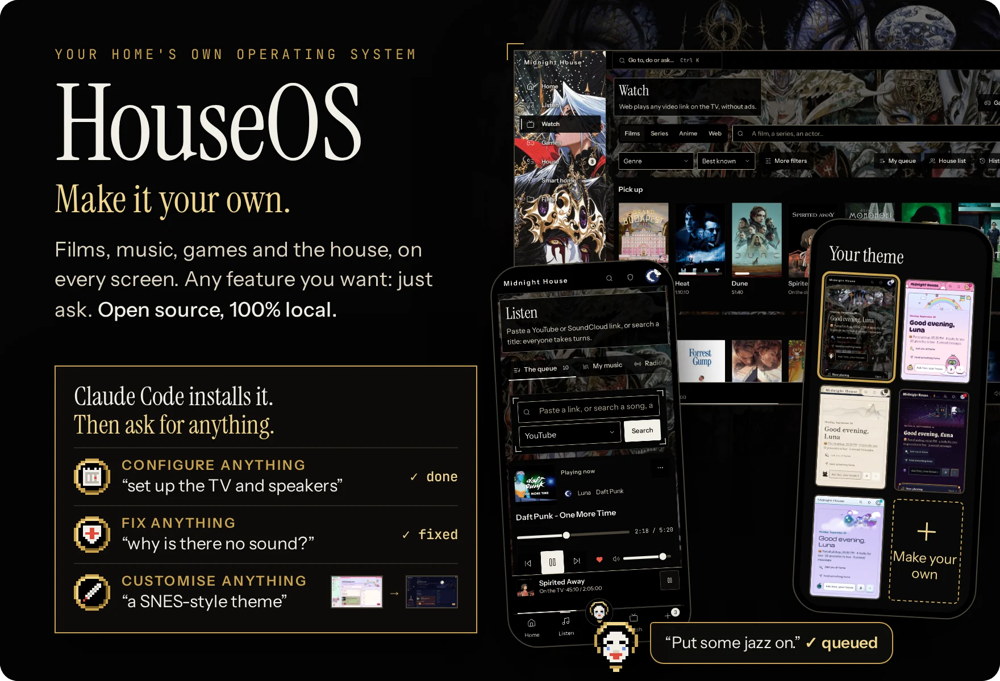
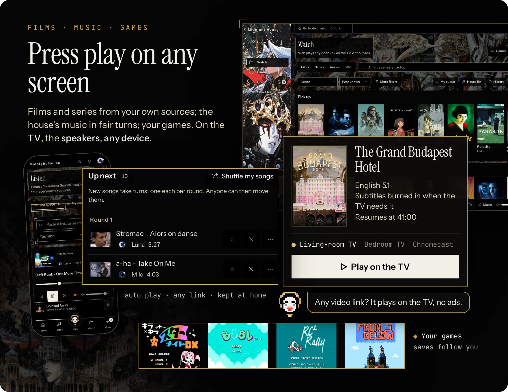
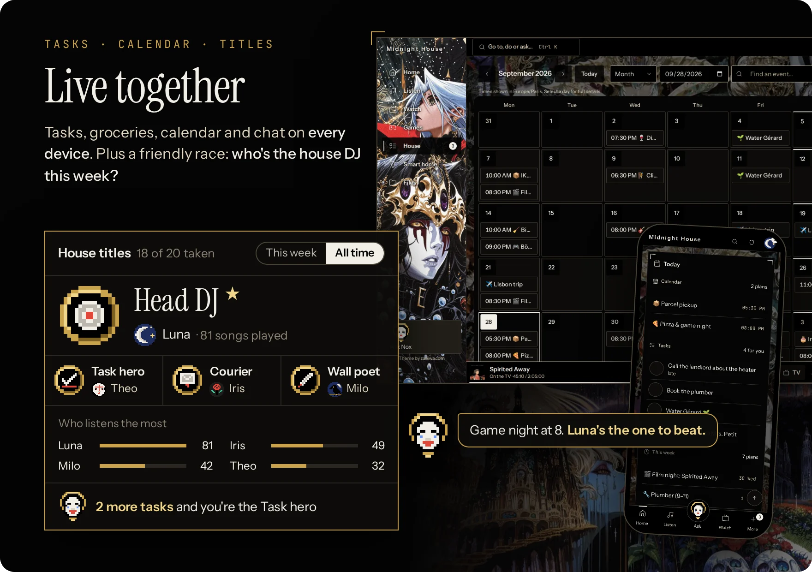
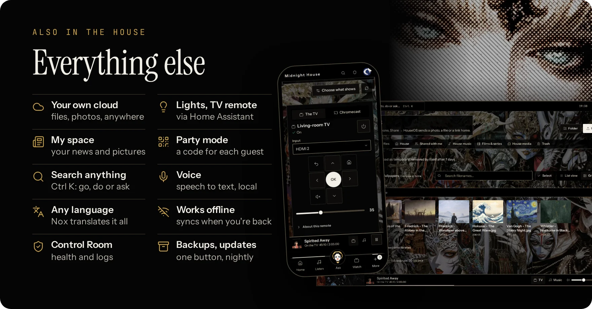
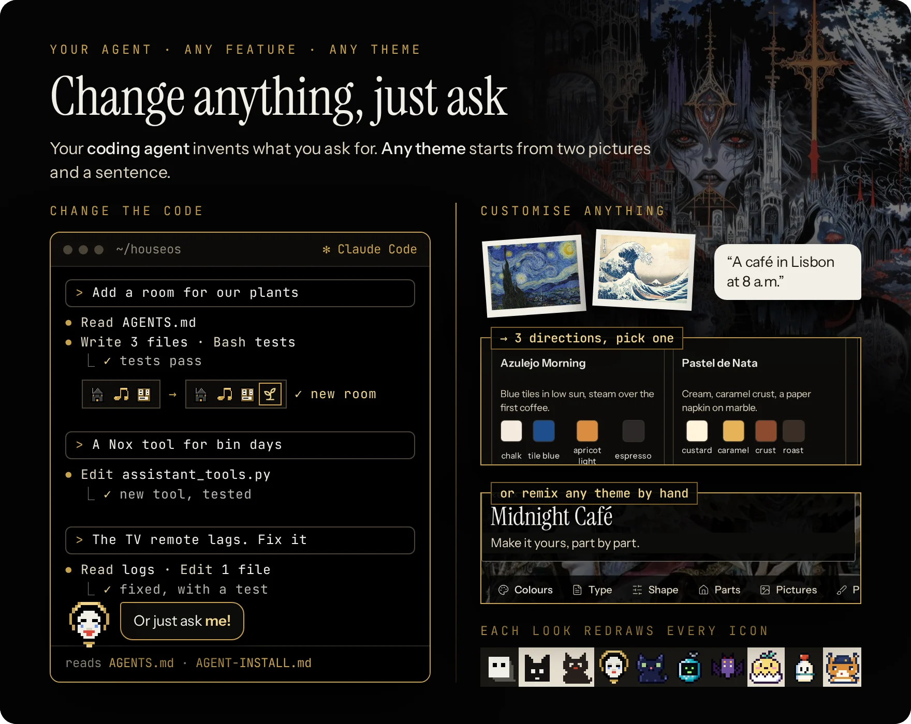
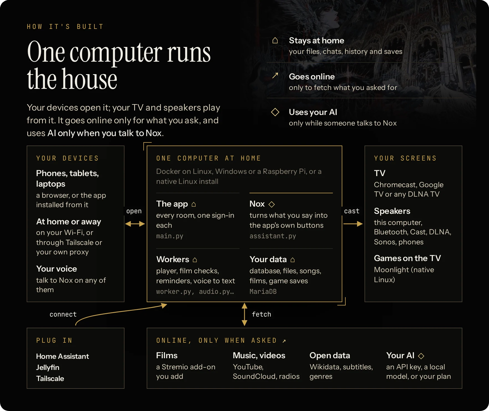
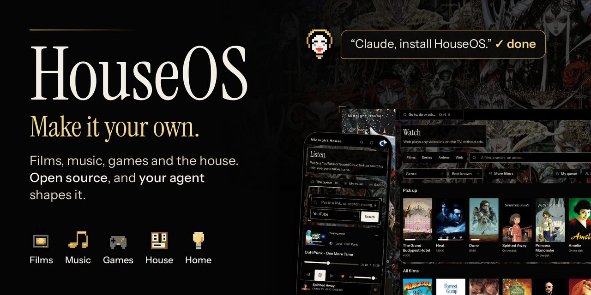

<div align="center">



**[🔑 Install](#-install)** · **[✨ Features](#-features)** · **[🎨 Make it yours](#-make-it-yours)** · **[🐳 Running it](#-running-houseos)** · **[📖 In detail](#-in-detail)**

    

</div>

## 🏠 What it is

**The open-source, self-hosted, fully customizable home platform.**
Movies and series (Stremio add-ons, debrid services, Jellyfin), music, games, your own cloud, smart home and AI agents: one free app on one computer at home, access it on any phone, laptop and TV around the world.

- 🍿 **Stream anything:** films, music, videos, games and your files, at home or across the globe.
- 🔒 **Free and local:** private, no account, no subscription, no ads. Agent features optional.
- 🎨 **100% customizable:** change any setting, any look, or create any feature you want.
- 🤖 **Your AI housekeeper:** ask Nox in plain words to set up the TV, fix what's wrong or build what's missing.
- 🧠 **Human brain or AI brain:** run the house yourself, or hand it to ChatGPT, Claude or a local model.

## 🔑 Install

Paste this into **Claude Code** (or any coding agent) on the computer that will run the house:

```text
Install HouseOS here and set it up with me.
Clone https://github.com/boitech-dev/HouseOS
and follow its AGENT-INSTALL.md.
```

<details>
<summary><b>⌨️ Or install it yourself</b> · and see requirements</summary>

- **Needs:** 64-bit Linux, a Raspberry Pi 4/5, or Windows 11 with WSL 2 · Docker Engine (not Docker Desktop) · 4 GB of memory (8 on Windows) · about 30 GB free.
- **Install**, on Linux:

  ```bash
  git clone https://github.com/boitech-dev/HouseOS.git && cd HouseOS && ./houseos.sh install
  ```

- **It takes** 10–20 minutes the first time (20–40 on a Pi) and ends with a one-time **setup code**. Open **`https://houseos.local:8443`** (or the address printed), accept the certificate once and enter the code.
- **No Docker yet?** `curl -fsSL https://get.docker.com | sh && sudo usermod -aG docker $USER`, then log out and back in.
- **Windows:** `wsl --install -d Ubuntu-24.04` as administrator, then [docs/WINDOWS.md](docs/WINDOWS.md) so phones can reach it, then the Linux line inside Ubuntu.
- **Mac:** can open HouseOS, can't host it.
</details>

## ✨ Features



<details>
<summary><b>🍿 Watch</b> · Stremio add-ons and a debrid service, one tap to the TV</summary>

- **Made for a Stremio add-on + a debrid service**, both of your choice: the recommended setup, for fast and reliable streams. Also works with Jellyfin, your own files, or the optional torrent player instead of a debrid service.
- **One tap to the TV** from any phone: a version in your languages that the TV can play, resume, next episode. Films go to Chromecast, Google TV and Android TV (and TVs with Chromecast built in); other smart TVs through the Jellyfin app. With Home Assistant it switches the TV on too.
- **Subtitles that just work:** from the file, OpenSubtitles, Jellyfin or your own upload, in each person's languages; converted for the TV, burned in when it can't show them.
- **Anywhere:** *Keep a copy at home* saves a film to the house disk; then, even away from home, it plays in the browser or streams to VLC or any player on your laptop or phone: nothing to install, nothing copied.
- **Films, series and anime:** seasons and episodes, *Continue watching*, your own list and a shared house watchlist, *For you* picks and *More like this*. Browse by year, theme, person or award.
- **Sleep timer:** the film stops and the TV can switch off.
- **Any video link:** a YouTube, TikTok or Instagram link or an `.mp4` plays on the TV without ads, gone 6 hours after you watch.
</details>
<details>
<summary><b>🎶 Listen</b> · one song each per round</summary>

- **Add anything:** search, a YouTube or SoundCloud link or playlist, one of 50,000 radio stations, or ask Nox.
- **Fair turns:** your next song lands in the next round. Anyone can move a waiting song; everyone has one **veto**, back 3 hours after use.
- **Kept at home:** after its first play a song stays on the house disk, instant next time, offline too.
- **Likes and playlists:** like a song to keep it in *My music*, make playlists or import one from a YouTube or SoundCloud link, replay anything from the house history, keep your radio stations.
- **Auto play:** when the queue runs dry it keeps going with the house's songs (all, or the genres you pick) or a rotation of radio stations. Its next 50 songs are a list anyone can reorder, trim or redraw; songs heard lately stay out, and a real request always goes first.
- **Sleep timer:** the music stops after 15 minutes, an hour, or when you say.
- **Plays on** the computer's speakers, Bluetooth, Cast, DLNA, Sonos, or a phone in *Speaker mode*.
</details>
<details>
<summary><b>🎮 Games</b> · your ROMs, every emulator ready</summary>

- **Every emulator ready:** about 30 consoles, NES to PlayStation in the browser, plus GameCube, Wii, PS2, PSP, Dreamcast and Saturn on the TV.
- **Bring your ROMs:** a folder, an upload or a link. Covers come from the open libretro database.
- **Play anywhere:** on your phone or laptop, at home or across the world, right in the browser: nothing to install, and no lag, the game runs on your device. With a controller or the keyboard.
- **On the TV** through Moonlight, on a native Linux install ([docs/GAMES.md](docs/GAMES.md)).
- **Catalogue** of every known game of a console, with what the house has; romhacks and translations from an `.ips` or `.bps` patch.
- **Your save follows you** from the phone to the TV and back; snapshots save anywhere, loaded from any device.
- **Game night:** favourites, a filter for 2, 3 or 4 players, and switch games from your phone while the TV plays.
</details>



<details>
<summary><b>📋 House board</b> · tasks, groceries, calendar</summary>

- **Tasks** in one line (what, when, who, how often): *I'll do it*, snooze until tomorrow, a file attached.
- **Groceries** ticked off in the shop, a **wall** for notes, a shared **calendar** with private events, reminders and an export to your calendar app.
- **Chat** between housemates, with photos and push notifications. **Home** shows today at a glance and who's around.
- **Invite** each housemate with a link (*Control Room → Invites*); guests get a party pass.
</details>
<details>
<summary><b>🏆 House titles</b> · who's DJ this week?</summary>

- **Titles** (Head DJ, Night owl, Task hero, Courier…) won from what everyone plays and does. Weekly ones change hands; all-time ones earn up to three ★.
- **The house in numbers:** who plays the most, when the house listens, film nights, top songs and games, and how close you are to your next title.
- **Invent your own:** ask your agent for a new title and it tracks any metric you like: who skips the most songs, who binges series at 3 a.m., who never does the dishes.
</details>



<details>
<summary><b>🗂️ Your own cloud</b> · files, photos, anywhere</summary>

- **Your files and photos**, shared folders and *Shared with me*, from anywhere through Tailscale or your own proxy. On Android, *Share → HouseOS* saves a photo in one tap.
- **The house library:** every kept song and film, playable in the browser.
- **Share for a while:** a file for one housemate for 2 hours, a day, a week or for good; take it back any time.
- **Search, grid view, PDF preview**, a duplicate finder for songs, and a **trash** for mistakes.
</details>
<details>
<summary><b>💡 Smart home</b> · lights and the TV remote</summary>

- **With Home Assistant:** lights (brightness, colour, warmth), plugs, blinds and heating by room, your favourites on top, scenes in one tap, or ask Nox to *"dim the living room"*.
- **A TV remote** on every phone: volume and playback over Cast, arrows after a one-time pairing, power and input through Home Assistant. On a laptop, the keyboard steers the TV.
- **Locks, alarms and sirens** stay off unless you allow them, and always wait for a second tap.
</details>
<details>
<summary><b>🎉 And more</b> · party, search, voice, offline</summary>

- **Party mode:** a tablet becomes the jukebox; guests scan a QR code to add songs.
- **Guest code:** the music and the TV for four hours, never the house's history or files.
- **Search:** *Ctrl K* goes anywhere, does things or asks Nox.
- **Voice:** speech becomes text on your own computer.
- **Languages:** English and French built in; Nox translates the app into any other.
- **Offline:** kept songs, your files and the house board still work.
- **My space:** your news, subreddits and pictures, on one page.
- **Nox, day to day:** puts music on, adds tasks, groceries and events, sends messages, dims the lights, reads a photo you add, and remembers what you tell it (you see and edit what it keeps).
- **Your data:** export your account, or delete it.
- **Control Room:** tests every part and says what to do; logs, one-tap backups and night updates (on Docker, with the Control Room buttons on).
</details>

## 🎨 Make it yours



**Every setting, every look, every feature: change it in plain words, or by hand.** Your coding agent edits the HouseOS folder; Nox lives in the app and changes things on a tap.

<details>
<summary><b>💻 Coding agent</b> · new rooms, tools, fixes</summary>

- **How:** open the HouseOS folder in Claude Code, Codex or any agent, let it work, and ask.
- **Written for agents:** [AGENTS.md](AGENTS.md) is the map; [docs/CHANGING-HOUSEOS.md](docs/CHANGING-HOUSEOS.md) walks a feature end to end (route → Nox tool → screen → translation → test), so each one is a button and something Nox can do.
- **Ask for:** a room for the plants, a Nox tool for bin days, a fix for a laggy TV remote, a new language.

```text
Read AGENTS.md. Add a room for our plants:
watering days, a photo of each, and
a reminder for whoever's turn it is.
```
</details>
<details>
<summary><b>💬 Nox sets it up</b> · a card, then your tap</summary>

- **Setup mode:** an admin opens it; Nox checks what's wrong and explains errors in plain words.
- **On a card:** quiet hours and the volume cap, time zone, auto play, which speaker plays, which smart-home devices show up, the TV's input for films, invites, AI budgets, which AI does what, night updates, trash settings, restarting a service, trusting a new address.
- **Your tap applies it:** the card shows the exact change and runs only when you press Confirm, from your own browser, with your own rights.
- **Never from a card:** making someone admin, turning accounts off, AI provider addresses, backups, sign-in, deleting people or data. Keys are typed on their own screen.

```text
Set quiet hours from 11 p.m.
Why was there no sound last night?
```
</details>
<details>
<summary><b>🛠️ Nox drafts code</b> · you review, Apply or Undo</summary>

- **Drafts** what no setting covers, in the app's own code, never the install or check scripts. On Docker, screens and themes come prebuilt, so its drafts change server code there.
- **You review** the whole diff in *Control Room → Changes*; **Apply** takes only that exact diff.
- **Safe to try:** a backup, the checks, a restart (the music picks up where it was), and a rollback if the house doesn't come back.
- **Keep or Undo:** Keep deletes the backup, Undo returns to it. Both wait while a film plays. On Docker, first `./houseos.sh buttons on`.
</details>
<details>
<summary><b>🖌️ Themes</b> · customize every part of the look, in plain words or pictures</summary>

- **Ten ship.** Each changes colours, type, shapes, pictures, Nox, every icon and the titles' medals. Themes are data, not code: they can't break a screen.
- **Create any theme you want:** describe it in plain English, add pictures if you like, to Nox's theme studio or your agent. It offers three directions, builds the one you pick and checks every screen stays readable.
- **Remix by hand** in the workshop, no AI needed.
- **Share it:** one `.houseos-theme` file, brought in from *Your preferences → Appearance*.

```text
Read themes/AGENT-KIT.md. Make a theme
from these two photos: a café in Lisbon
at 8 a.m., warm and calm.
```
</details>

**Made something good?** A theme, a room, a Nox tool, a fix: open a pull request, or show it in **[Discussions](https://github.com/boitech-dev/HouseOS/discussions)**.

## 🐳 Running HouseOS

One computer at home runs the house in Docker; everyone else opens a browser.

**Easiest: let your agent run it.** Open the HouseOS folder in Claude Code (or any coding agent) and ask: *"update HouseOS"*, *"back it up"*, *"why is there no sound?"*. [AGENTS.md](AGENTS.md) tells it how. Or just ask Nox, right in the app: *"why is there no sound?"*, *"update HouseOS"*.

<details>
<summary><b>🛠️ Run it yourself</b> · requirements, commands, ports, remote access, updates, backups</summary>

<details>
<summary><b>💻 What it runs on</b> · Linux, Raspberry Pi, Windows</summary>

| Computer | Runs HouseOS? |
|---|---|
| 🐧 **Linux**, x86_64 or arm64: a mini-PC, a NAS, an old laptop | ✅ Ubuntu, Debian and most distros |
| 🍓 **Raspberry Pi 4/5**, 4 GB+, 64-bit OS, an SSD rather than the SD card | ✅ slower first build and voice |
| 🖥️ **Windows 11** (22H2+) with WSL 2 | ✅ [docs/WINDOWS.md](docs/WINDOWS.md) |
| 📦 **Unraid, Proxmox, Fedora, Mint, Arch** | ✅ [a few notes](docs/DOCKER.md#11-other-systems) |
| 🍎 **macOS** | opens HouseOS, can't host it |
| ❌ Podman, rootless Docker, 32-bit | not supported. Docker Desktop starts it, but can't cast or find devices |

**Needs:** Docker Engine with Compose v2 (2.24+) · 4 GB of memory (8 comfortable) · about 30 GB free, plus room for songs and films · the same network as the phones (not a guest Wi-Fi). No screen or speakers needed.
</details>

<details>
<summary><b>⌨️ Commands</b> · update, backup, logs and the rest</summary>

```bash
./houseos.sh                  # the menu
./houseos.sh install          # first install
./houseos.sh update           # new version, rebuilt; the music resumes at the same second
./houseos.sh backup           # database + state (keys) + files into backups/<date>
./houseos.sh status           # what runs
./houseos.sh logs [api worker…]   # what it says, live
./houseos.sh setup-code       # the one-time setup code again
./houseos.sh buttons on|off   # the Control Room buttons (update, backup… from the app)
./houseos.sh gpu on|off       # voice typing on an NVIDIA card, or the processor
./houseos.sh torrents on|off  # the torrent player: a stream add-on without a debrid service
./houseos.sh own-address      # HouseOS as its own device on the network
```

`docker compose down` stops HouseOS and keeps everything. `docker compose down -v` **deletes** it all: only for a real fresh start.
</details>

<details>
<summary><b>🌐 Addresses and ports</b> · houseos.local, 8443, 8991</summary>

| Open | When |
|---|---|
| `https://houseos.local:8443` | the usual way, from any device at home. The browser warns once about the certificate: it's your house's own |
| `https://<server-ip>:8443` | if `houseos.local` doesn't open (some Android and older Windows) |
| `https://your.domain` | behind your own proxy, pointed at `http://<server>:8990` |

- **Sign up at the address the phones will use:** only that one is trusted at first. Add others in *Control Room → Access*.
- **No more certificate warning:** *Control Room → Access → Download the certificate* on each device, or use a proxy or Tailscale (below).
- **Ports, from the home network only:** TCP 8443 (the app), TCP 8991 (media for TVs and speakers), UDP 5353 and 1900 (Find devices, `houseos.local`). 8990 is plain HTTP for a proxy, on this computer only.
- **Port 8443 taken?** The install picks 9443 or the next free one and says so.
</details>

<details>
<summary><b>🔐 From outside home</b> · Tailscale or your own proxy</summary>

**Tailscale** gives a real certificate with nothing to configure:

```bash
tailscale serve --bg 8990
```

Then open `https://<server>.<tailnet>.ts.net` and add it in *Control Room → Access*.

**Caddy** (nginx, Apache, Traefik and proxies in containers: [docs/DOCKER.md §3](docs/DOCKER.md#3-behind-your-own-reverse-proxy)):

```text
house.example.lan {
    reverse_proxy 127.0.0.1:8990
}
```

Never open HouseOS to the whole internet: use your network or a private VPN like Tailscale.
</details>

<details>
<summary><b>🔄 Updates</b> · by command, a button or at night</summary>

- **`./houseos.sh buttons on`** (or *yes* at install) adds a small helper, so *Control Room → Services* can update, back up and move voice to the graphics card with a button.
- **New versions:** HouseOS then checks every 6 hours and Nox leaves admins a note. Press *Update HouseOS*, ask Nox *"update HouseOS"*, or tick *Update by itself at night* (3–5 am, only when nothing plays).
- **Know what it means:** the helper holds Docker's socket, which is as strong as being this computer's admin. It has no network and runs only `houseos.sh`'s fixed actions, when the app asks with a note signed by the house's own key. `./houseos.sh buttons off` removes it.
</details>

<details>
<summary><b>💾 Backups</b> · one command, and restoring</summary>

`./houseos.sh backup` writes `backups/<date>/`: the database, the state (with the keys that unlock saved passwords) and your files, plus your settings. Everything pauses for about a minute. Keep them private and copy them to another disk.

To restore on a fresh clone, before the first start:

```bash
cp backups/<date>/houseos.env .env && chmod 600 .env
docker compose create
docker compose run --rm --no-deps -u 0 -v "$PWD/backups/<date>":/b --entrypoint tar db  xzf /b/houseos-db.tgz -C /var/lib/mysql
docker compose run --rm --no-deps -u 0 -v "$PWD/backups/<date>":/b --entrypoint tar api xzf /b/houseos-files.tgz -C /
docker compose up -d
```
</details>

<details>
<summary><b>⚙️ Options</b> · graphics card, your own folders, no Docker</summary>

- **Voice on an NVIDIA card:** `./houseos.sh gpu on`, with the NVIDIA Container Toolkit. It falls back to the processor by itself. The microphone needs an `https://` address.
- **Raspberry Pi:** the same install, 20–40 minutes the first time; voice uses the smaller speech model. HDMI sound: pick the HDMI output in *Control Room → Speakers*.
- **Your existing music, films and games:** the `import` folder next to HouseOS, or point `HOUSEOS_IMPORT_DIR` in `.env` at yours. HouseOS reads them where they are and never changes them.
- **Two HouseOS on one network:** `HOUSEOS_MDNS_NAME=` in `.env` gives one another name.
- **Games on the TV** (Moonlight) need HouseOS installed directly on Linux: [docs/GAMES.md](docs/GAMES.md).
- **Without Docker:** [docs/SETUP.md](docs/SETUP.md) lists what to provide by hand.
- **Something's off?** `./houseos.sh logs`, then the table in [docs/DOCKER.md → When something is off](docs/DOCKER.md#when-something-is-off).
</details>
</details>

**Guides:** [START-HERE](docs/START-HERE.md) (English and French) · [DOCKER](docs/DOCKER.md) (every option) · [WINDOWS](docs/WINDOWS.md) · [DEVICES](docs/DEVICES.md) (TVs, speakers and remotes, by brand) · [SETUP](docs/SETUP.md) (no Docker)

## 📖 In detail

<details>
<summary><b>🏗️ How it's built</b> · one computer, every screen</summary>



- **Runs on** Docker (Linux, Windows, Raspberry Pi) or natively on Linux.
- **Inside:** FastAPI over MariaDB, one React app for every screen, small workers for music, films, fetching and voice.
- **Code first:** queues, turns, titles and reminders are plain code; a language model runs only while someone talks to Nox.
- **Built at home:** HouseOS's images are built on your computer (on the official `python` and `docker` images); MariaDB, tusd and Caddy come ready-made.
- More: [docs/ARCHITECTURE.md](docs/ARCHITECTURE.md).
</details>

<details>
<summary><b>🔌 What you bring</b> · your AI, your films, your speakers</summary>

Nothing personal ships with HouseOS. In the app's **Control Room** you add:

- **Your favourite AI for Nox:** your ChatGPT or Claude subscription, any API key (OpenRouter, OpenAI, Anthropic…), or a local model (Ollama, LM Studio…). Every feature also has its buttons, so the house still works without it.
- **Films:** a Stremio add-on and a debrid service of your choice (recommended), or Jellyfin, your own files, the optional torrent player.
- **Games:** your own ROMs; a console's BIOS when it needs one.
- **Speakers and TVs:** *Find devices* lists Chromecast, Google TV, Android TV, DLNA and Sonos on your Wi-Fi; music also plays on the computer itself, a Bluetooth speaker, or phones.
- **Home Assistant**, for the smart home and the TV's power and input.

The full checklist: **[AGENT-INSTALL.md §5](AGENT-INSTALL.md#5-walk-through-the-setup)**.
</details>

<details>
<summary><b>🎶 How the music works</b></summary>

- Songs are fetched once and **kept on the house disk** after their first play: the next time they
  start instantly, and Files lists them with sort and filters (genre, who played them).
- Fair turns decide where a new song lands; after that, the queue's order is simply its positions,
  which anyone can change. A song pinned "right after this one" keeps its place.
- Levels: each song gets **one fixed gain** measured before it plays (quiet uploads up about 20 %,
  dangerously loud ones down about 15 %). No compressor, no mid-song changes: only a guard on peaks that would clip. This applies to the computer's own speakers; Cast, DLNA and Speaker mode play the file as it is.
- **Auto play** only adds one pick at a time, and only when nothing waits: a request always plays next,
  and a rotating station steps aside the moment someone queues a song. Its next 50 songs are a
  saved list anyone at home can reorder, trim or redraw; songs heard lately stay out.
</details>

<details>
<summary><b>🍿 How films get to the TV</b></summary>

- Search or browse; HouseOS finds versions in the sources you connected, **probes them in a
  sandbox**, three at a time, and ranks them: something you can follow first (sound or subtitles in
  your languages), then original audio, subtitles inside the file, a format your TV plays as it is.
  If none of the first fits your TV, it checks the next ones by itself and tells you why.
- Subtitles come from the file, OpenSubtitles, Jellyfin or your own upload; text subtitles are
  converted for the TV, and burned into the picture only when the TV can't show them.
- You confirm once; it casts to the Chromecast or Google TV and shows what really plays. Resume, seek, next episode and a sleep timer work
  from any phone.
- Films kept at home play right in a browser when their formats allow, or stream to VLC or any
  player through a private link that lasts 12 hours. Nothing is copied to the device.
- Filters and collections run on a **local index** built from Wikidata (films and series) and the
  anime-offline-database, so they answer instantly and work offline.
</details>

<details>
<summary><b>📺 How web videos get to the TV</b></summary>

- *Watch → Web* takes any link, or a whole shared message: the address is found in it. On Android,
  **Share → HouseOS** offers **Play this video on the TV**.
- The sandboxed fetcher reads it with **yt-dlp** (YouTube and ~1,800 sites) and fetches the best
  version up to 1080p. You get the video itself: no ads. **It starts on the TV within seconds** and
  the rest follows.
- Then it's a film like any other: the same controls, resume, and conversion when the TV can't
  play a format. If something else is on, the card asks before replacing it.
- The file is deleted **6 hours after its last play** (never while on a screen); the folder stays
  under 20 GB. *Play again* downloads it again.
- Won't play, and says so: live streams, copy-protected services (Netflix…), videos behind a
  sign-in, longer than 4 hours or bigger than 6 GB.
</details>

<details>
<summary><b>🔒 Privacy</b></summary>

- Nox chats, film history, private events, personal files and game saves stay with their owner.
- Every action goes through the same permission checks, whether it comes from a button or from Nox.
- Nothing plays, casts or turns on by itself; Nox asks before touching the TV.
- Errors are sentences, in your language, that say what to do next.
- Public catalogues are cached; a service that's down never freezes the app.
</details>

<details>
<summary><b>❓ FAQ and common hiccups</b> · <i>click a question to open it ▸</i></summary>

#### 🏠 The basics

<dl><dd>

<details><summary><b>Is it free?</b></summary>

Yes, MIT. Only what you choose may cost something: a paid AI, a debrid service.

</details>
<details><summary><b>Does it need the internet?</b></summary>

For new songs, radio, film streams, web videos and a cloud AI. Kept songs, your files, the house board and Watch's filters work without it.

</details>
<details><summary><b>Can I use it away from home?</b></summary>

Yes, through Tailscale or your own reverse proxy ([docs/DOCKER.md §3](docs/DOCKER.md#3-behind-your-own-reverse-proxy)): your files, the house board, films kept at home and your games, in the browser.

</details>
<details><summary><b>Who sees what?</b></summary>

Chats, film history, private events, personal files and game saves stay with their owner. Guests only get the music queue and the TV.

</details>
<details><summary><b>Which languages?</b></summary>

English and French are built in. Ask Nox for another and it translates the whole app; everyone picks theirs in *Your preferences*.

</details>
<details><summary><b>Which browsers and phones?</b></summary>

Recent Chrome, Edge, Firefox and Safari. iPhone and iPad: iOS 15 or later; notifications need iOS 16.4+ and HouseOS added to the Home Screen.

</details>

</dd></dl>

#### 🎨 Looks and AI

<dl><dd>

<details><summary><b>How do I change the look?</b></summary>

- *Your preferences → Appearance*: your theme (or the house's), light or dark, motion. *Control Room → Themes*: the default for new people, and making themes (Remix, Nox's studio, the workshop).
- The studio uses its own AI (*Control Room → AI → Theme studio*).

</details>
<details><summary><b>Which AI, film sources and music links work?</b></summary>

- **AI for Nox:** ChatGPT or Claude subscriptions, OpenAI, Anthropic, OpenRouter, and any OpenAI-compatible server (Ollama, LM Studio, vLLM, Groq, Mistral…; the address usually ends in `/v1`).
- **Films:** a Stremio add-on with a debrid service (recommended), Jellyfin (Emby likely works), your own files (existing folders under `/import`, [docs/DOCKER.md](docs/DOCKER.md)). Plex isn't supported: point Jellyfin at the same folders.
- **Music:** YouTube (and YouTube Music playlists), SoundCloud, radios, your files. Spotify and Deezer links can't play: type the song instead.
- **Web videos:** YouTube, TikTok, Instagram, X, Reddit, Dailymotion, Twitch videos, direct `.mp4` links and most sites yt-dlp knows.

</details>

</dd></dl>

#### 🎮 Games

<dl><dd>

<details><summary><b>Where do the games come from?</b></summary>

You bring your ROMs: an upload, a link to a file you keep online, or the folder where you already keep them (read where it is, never copied). HouseOS never downloads a game; it only fetches emulators and open data (names, covers). A console that needs a BIOS gets it from you too. [docs/GAMES.md](docs/GAMES.md)

</details>

</dd></dl>

#### 🔄 Updates

<dl><dd>

<details><summary><b>How do I update?</b></summary>

On the server: `./houseos.sh update`. With the Control Room buttons on (`./houseos.sh buttons on`,
or *yes* when installing), HouseOS also looks for new versions by itself and Nox leaves admins a
note when one is out. Then:
- *Control Room → Services → Update HouseOS*;
- or ask Nox: *"update HouseOS"*;
- or tick *Update by itself at night* (3–5 am, only when nothing plays).

Details: [docs/DOCKER.md §9](docs/DOCKER.md#9-updates-backups-and-the-control-room-buttons).

</details>

</dd></dl>

#### 📺 TVs, speakers and devices

<dl><dd>

<details><summary><b>How do I set up my TVs and speakers?</b></summary>

1. *Control Room → Devices → Find devices*, then **Add**.
2. Choose where music plays in *Control Room → Speakers*.
3. For power, sources and arrows on a TV: add its integration in Home Assistant, then connect Home Assistant in *Control Room → Integrations*.

Step by step: [docs/DEVICES.md](docs/DEVICES.md#setting-up-your-devices-step-by-step).

</details>

</dd></dl>

#### 🆘 Still stuck?

Phones can't open it, a certificate warning, no sound, no microphone, a TV not found: the table in [docs/DOCKER.md → When something is off](docs/DOCKER.md#when-something-is-off). Or ask Nox in setup mode, or your own coding agent.
</details>

<details>
<summary><b>🔧 Fixing things with Nox or your agent</b></summary>

- **Control Room → Setup and Health** check every part for real; **Services** says in plain words which part stopped and what to do; **Logs** lists what happened (songs, films, Nox's actions, chores, errors).
- **Nox's setup mode** (admins): ask *"what isn't working?"*, *"find my TV"*, *"why did the film fail last night?"*. It reads the same logs and checks, explains in plain words, and fixes what it's allowed to.
- **Your coding agent** (Claude Code, Codex…): open the HouseOS folder and say *"Read AGENTS.md. Watch shows no posters: find out why and fix it."* It knows where everything lives, how to test, and how to rebuild with `./houseos.sh update`.
</details>

<details>
<summary><b>🤖 For agents and developers</b></summary>

- **Install:** [AGENT-INSTALL.md](AGENT-INSTALL.md), step by step.
- **Change:** [AGENTS.md](AGENTS.md) (map, rules, tests) · [docs/CHANGING-HOUSEOS.md](docs/CHANGING-HOUSEOS.md) (a feature end to end) · [docs/CODE-INDEX.md](docs/CODE-INDEX.md) (every module and route).
- **Guides:** [THEMES](themes/README.md) · [START-HERE](docs/START-HERE.md) · [DOCKER](docs/DOCKER.md) · [SETUP](docs/SETUP.md) (no Docker) · [WINDOWS](docs/WINDOWS.md) · [DEVICES](docs/DEVICES.md) · [INTEGRATIONS](docs/INTEGRATIONS.md) · [GAMES](docs/GAMES.md)
- **The stack at a glance:** Docker services `api` (FastAPI), `https` (Caddy, port 8443), `db` (MariaDB), `worker` (music), `cinema-worker` and `cinema-observer` (films), `fetch` (the only part that talks to YouTube, SoundCloud and radios), `audio` (the speakers), `relay` (media for TVs, port 8991), `voice`, `tusd` (uploads), `maintenance`, and `codex`/`claude` (subscription sign-ins); `helper` only with the Control Room buttons. Data in the volumes `houseos-db`, `houseos-state` (keys: keep private) and `houseos-data`.
- **House rules for agents:** never cut the music (restart the worker between songs), never test on someone's TV or speakers without asking, keys never go into chat, logs or git.
- **Tested from scratch:** every release is installed on a clean machine before it ships; what's tested: [docs/TESTING.md](docs/TESTING.md).
</details>

<div align="center">

</div>

## 📜 License and credits

MIT ([LICENSE](LICENSE)); the rest is in [NOTICE.md](NOTICE.md). HouseOS ships no media and no accounts.

Made by **[BoiTech](https://boitech.dev)**.
**The Zabiwa theme**, the look of this page, is a collaboration with the digital artist **[Zabiwa](https://zabiwa.com)**: its pictures are details of the artist's artworks, made for HouseOS.
